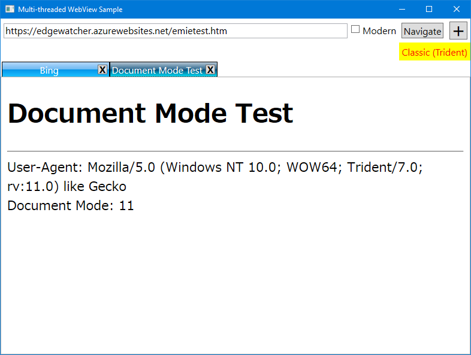

# Multi-threaded WebView2 Sample

This is a sample WPF application that handles multiple WebView2 (Chromium) instances in a multi-tabbed container, and also implements the option to switch WebView2 to WebBrowser (Trident).

You can add an Internet Explorer (Trident) view by unchecking the **Modern** checkbox and clicking the **[+]** button.

